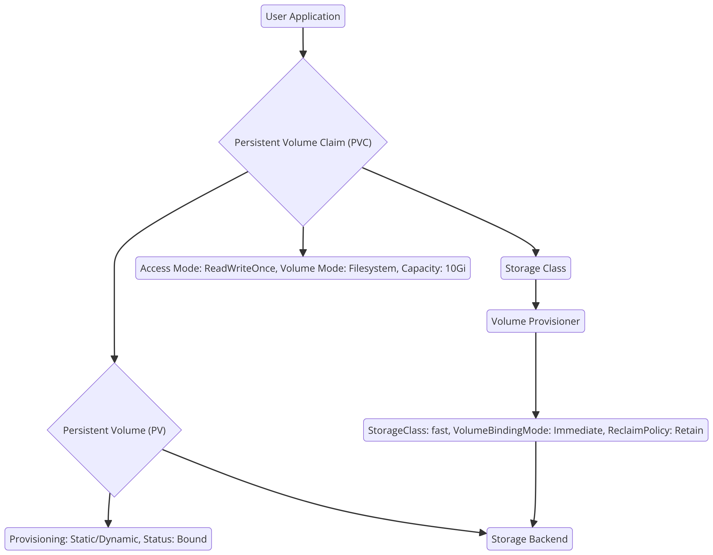

# 1. Persistent Volume Static Provision
## TIP-1: PV and PVC's Configuration Matching

To ensure a successful binding between a PersistentVolume (PV) and a PersistentVolumeClaim (PVC), several parameters need to align. Here's a summary of the mandatory parameters and considerations:

### 1. Storage Capacity

- **PV:** The `capacity` field in the PV specifies the amount of storage available.
- **PVC:** The `resources.requests.storage` field in the PVC specifies the amount of storage requested.
- **Matching Requirement:** The capacity of the PV must be equal to or greater than the storage requested by the PVC.

### 2. Access Modes

- **PV:** The `accessModes` field in the PV specifies the ways the volume can be accessed (e.g., `ReadWriteOnce`, `ReadOnlyMany`, `ReadWriteMany`).
- **PVC:** The `accessModes` field in the PVC specifies the required access modes for the volume.
- **Matching Requirement:** The PV must support all the access modes requested by the PVC. For example, if the PVC requests `ReadWriteOnce`, the PV must include `ReadWriteOnce` in its access modes.

### 3. StorageClass (Optional for Static Provisioning)

- **PV:** The `storageClassName` field in the PV specifies the class of storage.
- **PVC:** The `storageClassName` field in the PVC specifies the desired class of storage.
- **Matching Requirement:** If a `storageClassName` is specified in both the PV and PVC, they must match. If the `storageClassName` is omitted in the PVC, it will only bind to PVs without a `storageClassName`.

### 4. Volume Mode (Optional)

- **PV:** The `volumeMode` field can be set to `Filesystem` or `Block`.
- **PVC:** The `volumeMode` field can be set to `Filesystem` or `Block`.
- **Matching Requirement:** The `volumeMode` of the PV and PVC must match if specified.

### 5. Node Affinity (Optional)

- **PV:** The `nodeAffinity` field can specify constraints on which nodes the PV can be accessed from.
- **Matching Requirement:** The PVC will only bind to a PV if the PV's node affinity constraints are satisfied.

### Example of a Matching PV and PVC

#### PersistentVolume (PV)
```
apiVersion: v1
kind: PersistentVolume
metadata:
  name: my-pv
spec:
  capacity:
    storage: 10Gi
  accessModes:
    - ReadWriteOnce
  storageClassName: my-storage-class  # Optional for static provisioning
  volumeMode: Filesystem  # Optional
  hostPath:
    path: /mnt/data

```

#### PersistentVolumeClaim (PVC)

```
apiVersion: v1
kind: PersistentVolumeClaim
metadata:
  name: my-pvc
spec:
  accessModes:
    - ReadWriteOnce
  resources:
    requests:
      storage: 10Gi
  storageClassName: my-storage-class  # Must match the PV if specified
  volumeMode: Filesystem  # Optional

```
### Key Points:

- **Storage Capacity and Access Modes are the most critical parameters.**
- **StorageClass and VolumeMode are optional but should match if specified.**
- **Node Affinity is an additional constraint that can affect binding.**

## TIP-2: PV and PVC Binding Using ClaimRef and VolumeName

In Kubernetes, **PersistentVolumes (PVs)** and **PersistentVolumeClaims (PVCs)** can be manually bound using the `claimRef` field in the PV and the `volumeName` field in the PVC. This allows for explicit and strict binding between a PV and a PVC, overriding the dynamic binding process.

When using these fields, the **capacity** and **access modes** must still match for the binding to be successful. If the parameters don’t match, the binding will fail, and the resources will remain unbound.

### Detailed Explanation:

1. **ClaimRef in PV:**
```
apiVersion: v1
kind: PersistentVolume
metadata:
  name: my-pv
spec:
  capacity:
    storage: 20Gi
  accessModes:
    - ReadWriteMany
  claimRef:
    namespace: default
    name: my-pvc

```
    
2. **VolumeName in PVC:**
```
apiVersion: v1
kind: PersistentVolumeClaim
metadata:
  name: my-pvc
spec:
  accessModes:
    - ReadWriteMany
  resources:
    requests:
      storage: 20Gi
  volumeName: my-pv

```


## TIP-3: What Happens in Case of a Mismatch

- **Capacity Mismatch:** If the requested storage in the PVC exceeds the available storage in the PV, the binding will not occur. The PVC will remain in a pending state because it cannot be satisfied by the PV's capacity.
- **Access Modes Mismatch:** If the access modes requested by the PVC are not supported by the PV, the binding will not occur. Kubernetes requires that the access modes requested in the PVC must be a subset of those provided by the PV.

### Example of Mismatch:

In the provided example, the PVC requests `20Gi` of storage and `ReadWriteMany` access mode, while the PV provides only `10Gi` of storage and supports `ReadWriteOnce`. This mismatch will prevent the binding despite the explicit references.
1. **ClaimRef in PV:**
```
apiVersion: v1
kind: PersistentVolume
metadata:
  name: my-pv
spec:
  capacity:
    storage: 10Gi
  accessModes:
    - ReadWriteOnce
  claimRef:
    namespace: default
    name: my-pvc

```
    
2. **VolumeName in PVC:**
```
apiVersion: v1
kind: PersistentVolumeClaim
metadata:
  name: my-pvc
spec:
  accessModes:
    - ReadWriteMany
  resources:
    requests:
      storage: 20Gi
  volumeName: my-pv
```

### Error Handling:

- Kubernetes will log events indicating the reason for the binding failure. These logs can be seen using `kubectl describe pvc <pvc-name>` or `kubectl describe pv <pv-name>`.
- The PVC will remain in a `Pending` state, waiting for a suitable PV that matches its requirements.


# 2. Persistent Volume Dynamic Provision

Dynamic provisioning automates the creation of PVs based on the request from PVCs. This method is more flexible and scalable compared to static provisioning.

## TIP-1: StorageClass and provisioner

- Dynamic provisioning relies heavily on the **StorageClass** object, which defines the storage type, the provisioner responsible for creating volumes, and policies such as reclaim and volume expansion.

- **Provisioner:** The provisioner field in the StorageClass specifies the plugin or cloud provider that will handle the dynamic provisioning (e.g., AWS EBS, GCP PD).

Example StorageClass:
```
apiVersion: storage.k8s.io/v1
kind: StorageClass
metadata:
  name: my-storage-class
provisioner: kubernetes.io/aws-ebs  # The provisioner that creates PVs dynamically
reclaimPolicy: Retain  # Defines how to handle PVs after they are released
allowVolumeExpansion: true  # Enables resizing of PVCs

```

## TIP-2: VolumeBindingMode

- **Immediate**: The PV is bound to the PVC as soon as the PVC is created. This is commonly used for cases where the storage does not have strict node requirements (e.g., network-attached storage).

- **WaitForFirstConsumer**: The PV is not bound until a pod that references the PVC is scheduled. This mode is useful for storage that must be provisioned close to the consuming pod (e.g., local disks).

Example StorageClass with `WaitForFirstConsumer`:
```
apiVersion: storage.k8s.io/v1
kind: StorageClass
metadata:
  name: my-delayed-binding-class
provisioner: kubernetes.io/aws-ebs
volumeBindingMode: WaitForFirstConsumer

```
## TIP-3: Reclaim Policy

The reclaim policy determines what happens to a PV after its associated PVC is deleted.
- **Retain**: The PV is not deleted and remains available for manual reclamation.
- **Delete**: The PV is deleted automatically after the PVC is deleted.
- **Recycle**: The PV is scrubbed and made available for another PVC (deprecated).
## TIP-4: AllowVolumeExpansion

- This option allows a PVC to request more storage after it has been created. The provisioner must support this feature for it to work.

### Dynamic Provisioning Advantages:

- **Automated Scaling**: As PVCs are created, the necessary PVs are automatically provisioned.
- **Flexibility**: The `WaitForFirstConsumer` mode ensures optimal resource allocation by waiting until the pod is scheduled before provisioning the storage, making it ideal for node-local storage.
- **Customizability**: The `StorageClass` provides a wide range of options like reclaim policies, expansion, and volume binding modes.


# 3. Persistent Volume Claim modes and impact
## TIP-1: Different Access mode's impact
Access Modes define how the persistent volume can be mounted by the pods. Kubernetes supports three main access modes:

1. **ReadWriteOnce (RWO)**:
    
    - **What it means**: The volume can be mounted as read-write by a single node.
    - **Impact**: This is typically used for single-node applications where the data doesn’t need to be shared across multiple nodes (e.g., databases, single-instance applications).
    - **Key consideration**: If the pod dies and is rescheduled on another node, the volume needs to be detached from the original node and reattached to the new one. This process can cause delays.
2. **ReadOnlyMany (ROX)**:
    
    - **What it means**: The volume can be mounted as read-only by multiple nodes.
    - **Impact**: Useful for sharing data across multiple nodes, especially for applications that require access to shared configuration files, backups, or static datasets (e.g., web servers serving static content).
    - **Key consideration**: Since the volume is read-only, applications cannot write data to the volume. This access mode is not suitable for applications requiring write capabilities.
3. **ReadWriteMany (RWX)**:
    
    - **What it means**: The volume can be mounted as read-write by multiple nodes.
    - **Impact**: This access mode is ideal for applications requiring shared access to data across multiple nodes (e.g., replicated databases, distributed file systems, and shared logs).
    - **Key consideration**: Not all storage providers support RWX. Ensure that your cloud or on-premises environment supports this mode before choosing it for multi-node scenarios.

## TIP-2: Deployment Strategy with RWO (ReadWriteOnce) Volumes

When using the **ReadWriteOnce (RWO)** access mode, the volume can only be mounted as read-write by a single node. This can impact deployment strategies, particularly in environments where pods may be rescheduled or require scaling.

**Two common strategies to manage this:**

1. **Change to StatefulSet**:
    
    - **StatefulSets** are designed to work with applications that require stable, persistent storage across pod rescheduling and scaling. When using RWO volumes, the pod-to-volume binding in StatefulSets ensures that each pod has exclusive access to its own persistent volume, preventing conflicts and ensuring data consistency.
    - **Why use StatefulSet?**: Pods managed by StatefulSets have stable, unique identities and persistent storage, which is crucial for stateful applications (like databases) that need RWO volumes.
```
apiVersion: apps/v1
kind: StatefulSet
metadata:
  name: my-app
spec:
  replicas: 3
  selector:
    matchLabels:
      app: my-app
  template:
    metadata:
      labels:
        app: my-app
    spec:
      containers:
      - name: my-container
        image: my-app-image
        volumeMounts:
        - name: my-volume
          mountPath: /data
  volumeClaimTemplates:
  - metadata:
      name: my-volume
    spec:
      accessModes: [ "ReadWriteOnce" ]
      resources:
        requests:
          storage: 10Gi

```
2. **Update Deployment Strategy** (From Rolling Update to Recreate):

- For **Deployments** using RWO volumes, you may face issues during pod rescheduling. Since only one pod can mount the volume at a time, if Kubernetes tries to create a new pod while the old pod is still terminating, the new pod will remain in the **Pending** state due to volume access conflicts.
- **Solution**: Change the strategy from **RollingUpdate** to **Recreate**. This ensures that Kubernetes fully terminates the old pod before creating a new one, preventing the volume from being simultaneously attached to two pods.
```
apiVersion: apps/v1
kind: Deployment
metadata:
  name: my-deployment
spec:
  strategy:
    type: Recreate  # Ensures old pod is terminated before the new one starts
  replicas: 1
  template:
    spec:
      containers:
      - name: my-container
        image: my-app-image
        volumeMounts:
        - name: my-volume
          mountPath: /data
  volumeClaimTemplates:
  - metadata:
      name: my-volume
    spec:
      accessModes: [ "ReadWriteOnce" ]
      resources:
        requests:
          storage: 10Gi

```
## TIP-3: Different VolumeMode's impact

Volume Modes define the format in which the storage is exposed to the pod. There are two primary volume modes:

1. **Filesystem**:
    
    - **What it means**: The volume is mounted into the pod as a traditional filesystem.
    - **Impact**: This is the default and most common mode where the volume is mounted and can be accessed as a directory structure, supporting file operations like reading, writing, and modifying files.
    - **Use case**: Most typical applications use this mode, such as databases, log storage, and configuration file storage.
    - **Key consideration**: The pod interacts with the volume as if it is a standard filesystem.
2. **Block**:
    
    - **What it means**: The volume is presented as a raw block device and does not have a filesystem by default.
    - **Impact**: The pod can directly read/write from the block storage, which is often useful for performance-sensitive applications that handle their own I/O operations, such as databases or applications that need high-performance, low-latency storage access.
    - **Use case**: Database workloads like Cassandra or ElasticSearch may benefit from block devices where they manage their own I/O and performance tuning.
    - **Key consideration**: Applications need to know how to handle block devices directly. You may need to manually format the block device if a filesystem is required.

### Key Differences:

| **Volume Mode** | **Filesystem**                                  | **Block**                                       |
| --------------- | ----------------------------------------------- | ----------------------------------------------- |
| **Interface**   | Appears as a directory in the pod               | Appears as a raw block device                   |
| **Use case**    | General applications, file storage, log storage | Performance-sensitive applications, databases   |
| **Complexity**  | Easier to use and configure                     | Requires application-level management           |
| **Flexibility** | Supports most Kubernetes use cases              | Limited to specific use cases, high performance |


# 4. Persistent Volume Status and Data Recovery

By effectively managing **Reclaim Policies**, using **Persistent Volume Snapshots**, and understanding **PV States**, you can ensure that your persistent storage is resilient and recoverable

## TIP-1: PVC Reclaim Policies and PV States

### Reclaim Policies:
It defines what happens to the PersistentVolume (PV) once its associated PersistentVolumeClaim (PVC) is deleted. These policies play a crucial role in how data is managed and whether the volume can be reused or must be recreated. Here are the common reclaim policies:

1. **Retain**:
    
    - **What happens**: The PV is retained even after the PVC is deleted, allowing the PV (and the data it contains) to be manually reused.
    - **When to use**: Use this policy when you want to preserve the data on the volume even after the claim is deleted. This is useful for scenarios where data needs to be reviewed or manually reassigned to another PVC.
    - **Action required**: The PV will enter a **Released** state and needs to be manually cleared or re-bound to a new PVC to become available again.
2. **Delete**:
    
    - **What happens**: Both the PV and the associated underlying storage are deleted when the PVC is deleted.
    - **When to use**: Use this policy when you want to ensure that the storage is automatically cleaned up and released for use by other workloads.
    - **Important consideration**: Ensure that you don’t lose critical data, as it will be permanently deleted unless you have a backup or snapshot in place.
3. **Recycle** (Deprecated):
    
    - **What happens**: The volume is scrubbed (formatted) and made available for reuse.
    - **When to use**: This policy is deprecated and should be avoided in modern Kubernetes deployments. Use **Retain** or **Delete** instead.
**ReclaimPolicy**: Ensure that your **ReclaimPolicy** aligns with your use case. For critical data, use **Retain** to ensure data preservation. For ephemeral or easily replaceable data, **Delete** can help free up resources quickly.


### PersistentVolume (PV) States: 
PersistentVolumes go through different states depending on their lifecycle and interaction with PVCs:

- **Available**: The PV is available and ready to be bound to a new PVC.
- **Bound**: The PV is currently bound to a PVC and in use.
- **Released**: The PVC that was using the PV has been deleted, but the PV still exists. It cannot be used by other PVCs until it is manually reclaimed or reconfigured.
- **Failed**: The PV has failed due to an error or issue with the underlying storage system, and cannot be used until the issue is resolved.

Managing the state of PVs is critical to ensuring that your storage resources are effectively utilized and reclaimed.

**PV Cleanup**: For PVs that are no longer needed (e.g., in the **Released** state), you can delete them manually.

## TIP-2: Re-attaching the Persistent Volume to a Pod when the PVC is deleted (Reclaim Policy: Retain)

When the reclaim policy is set to **Retain**, the PV and its data are preserved after the PVC is deleted. This allows you to re-use the PV by binding it to a new PVC.

### How to Re-Attach a Retained PV to a New PVC:

1. **Recreate a PVC Bound to the Existing PV**:
    
    - You can manually create a new PVC and specify the `volumeName` field to bind the PVC to the existing retained PV. This allows the old volume to be reused by a new pod.

Example of Re-using a Retained PV:
```
apiVersion: v1
kind: PersistentVolumeClaim
metadata:
  name: my-pvc
spec:
  accessModes:
    - ReadWriteOnce
  resources:
    requests:
      storage: 10Gi
  volumeName: my-pv  # Bind to the existing PV

```
2. **Steps to Re-Attach a Volume**:
- **Step 1**: Verify the status of the PV by running:
    
    `kubectl get pv`
    
- **Step 2**: If the PV is in the "Released" state, update its status to available by removing the old `claimRef` using a patch:

    `kubectl patch pv <pv-name> -p '{"spec":{"claimRef": null}}'`
    
- **Step 3**: Create a new PVC and specify the `volumeName` as shown above to bind it to the existing PV.
- **Step 4**: Once the PVC is created and bound, deploy your pod using the PVC
```
apiVersion: v1
kind: Pod
metadata:
  name: my-pod
spec:
  containers:
  - name: my-container
    image: my-app-image
    volumeMounts:
    - name: my-volume
      mountPath: /data
  volumes:
  - name: my-volume
    persistentVolumeClaim:
      claimName: my-pvc  # Reference to the new PVC

```
## TIP-3: Re-attaching the persistent volume to a Pod when the PVC is deleted (Reclaim Policy: delete)?

If the reclaim policy is set to **Delete**, the PV and its underlying storage will be deleted when the PVC is removed. In this case, the volume cannot be re-attached directly. Instead, you must rely on **snapshots** or **backups** to restore the data.

### Steps to Handle Data Recovery with Reclaim Policy `Delete`:

1. **Snapshot and Backup Strategy**:
    
    - Before deleting the PVC, ensure you have created a snapshot or backup of the PV. This allows you to restore the data even after the PVC is deleted.
    - Many cloud providers (e.g., GCP, AWS) offer snapshot features for persistent disks. Kubernetes also supports VolumeSnapshots.
2. **Restoring from a Snapshot**:
    
    - If a PVC with the `Delete` reclaim policy was removed and a snapshot was taken, you can restore the data by creating a new disk from the snapshot and attaching it to a new PV.
    - **Example (GCP)**:
        
        - Go to the **Google Cloud Console**.
        - Navigate to **Compute Engine > Snapshots**.
        - Create a new disk from the snapshot.
        - Update your Kubernetes PV definition to use the new disk created from the snapshot:
```
apiVersion: v1
kind: PersistentVolume
metadata:
  name: restored-pv
spec:
  capacity:
    storage: 10Gi
  accessModes:
    - ReadWriteOnce
  gcePersistentDisk:
    pdName: restored-disk-from-snapshot  # Name of the new disk created from snapshot

```
**Redeploy the PVC and Pod**:

- Create a new PVC to bind to the restored PV and redeploy the pod using the PVC, as shown in **TIP-2**.

# 5. Persistent Volume Migration

Persistent Volume (PV) migration is an essential task when moving workloads between namespaces, clusters, or even across different platforms or cloud providers. Migrating PVs correctly ensures that critical data remains intact and accessible, minimizing downtime and disruptions.

There are different scenarios for migrating PVs:

- **Within the same cluster but across namespaces**
- **Between different clusters (e.g., from one Kubernetes cluster to another)**
- **Cross-platform migration (e.g., from one cloud provider to another)**

This section explores these scenarios in detail and introduces tools that can help facilitate PV migration.

## TIP-1: Same Cluster PV Migration (Across Namespaces)

Migrating Persistent Volumes across namespaces within the same cluster is relatively straightforward since the underlying storage infrastructure remains the same. However, you need to manage how PVCs and the associated pods are re-attached to the PVs in the new namespace.

### Steps for Migrating PVs Across Namespaces:

1. **Verify Reclaim Policy**:
    
    - Ensure the **ReclaimPolicy** of the PV is set to **Retain**. This allows the volume to be reused without being deleted when its associated PVC is removed.
2. **Delete the Old PVC** (In Source Namespace):
    
    - Before migrating, you need to delete the PVC in the source namespace to "release" the PV. However, the underlying PV and data will not be deleted if the reclaim policy is set to **Retain**.

    `kubectl delete pvc <pvc-name> -n <source-namespace>`
    
3. **Update the PV to Remove ClaimRef**:
    
    - After deleting the PVC, the PV enters the **Released** state. You need to update the PV to remove the old claim reference and make it available in the new namespace.
    `kubectl patch pv <pv-name> -p '{"spec":{"claimRef": null}}'`
    
4. **Recreate PVC in the Target Namespace**:
    
    - Create a new PVC in the target namespace, ensuring it references the same PV by specifying the `volumeName` field in the PVC spec.

5. **Update Resource Bindings**:
    
    - Update your pod or StatefulSet in the new namespace to use the new PVC.

## TIP-2: Different Cluster PV Migration (Same Cloud or On-Premise)

Migrating PVs between clusters is more complex, as you need to manage both the source and target clusters. The underlying storage needs to be moved or re-attached to the new cluster’s environment.

### Options for Migrating PVs Between Clusters:

1. **Cloud-Native Snapshot and Restore**:
    
    - Many cloud providers, such as AWS, GCP, and Azure, offer native snapshot services for their block storage systems (e.g., EBS in AWS, Persistent Disks in GCP).
    - **Steps**:
        1. **Create a snapshot** of the source PV in the original cluster.
        2. **Create a new volume** from the snapshot in the target cluster.
        3. Create a new **PersistentVolume** and **PersistentVolumeClaim** in the target cluster, attaching the newly created volume.
        4. Deploy your application in the target cluster with the new PVC.
2. **Volume Copy via Tools**:
    
    - If your cloud provider doesn’t support seamless snapshot and restore functionality between clusters, you can use tools like `rsync` or `velero` to copy data from one PV to another.
        
    - **Example with rsync**:
        
        1. Attach the source PV to a pod and copy the data to a temporary location (such as an S3 bucket or NFS share).
        2. In the new cluster, attach the target PV to a pod and restore the data using `rsync` or similar tools.
3. **Kubernetes Backup Tools (e.g., Velero)**:
    
    - **Velero** is an open-source tool designed for backing up and restoring Kubernetes clusters. It can back up Persistent Volumes and restore them in a different cluster.
    - **Steps**:
        1. Install Velero in the source cluster and perform a **backup** of your PVCs.
        2. Install Velero in the target cluster and perform a **restore**.
        3. Velero will restore the PVCs, and you can create the necessary pod or StatefulSet bindings to access the restored data.
    
    **Pros**: Velero can handle both the migration of Persistent Volumes and application configurations, ensuring a consistent migration across clusters.

## TIP-3: Cross-Platform PV Migration (Across Cloud Providers)

Cross-platform PV migration (e.g., from AWS to GCP) involves moving both the data and the underlying storage infrastructure to a new cloud provider. This is the most complex scenario, as the storage formats and APIs vary between cloud platforms.

### Steps for Cross-Platform Migration:

1. **Data Export and Import**:
    
    - The most reliable approach to cross-platform PV migration is exporting the data from the source cluster, moving it to the new cloud provider, and importing it into the target cluster.
    - **Steps**:
        1. **Backup the PV**: Use tools like **rsync**, **Restic**, or **Velero** to back up the data from the source PV.
        2. **Transfer Data**: Transfer the data to the target cloud provider’s storage (e.g., move data from AWS S3 to GCP Cloud Storage).
        3. **Create PV and PVC**: Once the data is transferred, create a new PersistentVolume in the target Kubernetes cluster using the appropriate cloud-native storage service (e.g., GCP Persistent Disk, Azure Managed Disk, or AWS EBS).
        4. **Restore Data**: Restore the data to the new volume using tools like **rsync** or **Restic**.
        5. Deploy your pod or StatefulSet in the new platform with the new PVC.
2. **Cloud-Native Migration Services**:
    
    - Some cloud providers offer tools and services that can help with cross-platform migrations. These services automate some aspects of moving workloads and their associated storage from one platform to another.
3. **Container Storage Interface (CSI)**:
    
    - Many cloud providers have adopted the **Container Storage Interface (CSI)**, which provides a standardized way to manage storage across different platforms. Using CSI-compatible storage providers can simplify migrations by allowing for consistent storage management across multiple clouds.
    - **Steps**:
        1. Ensure that both the source and target cloud providers support CSI for persistent storage.
        2. Use a CSI storage plugin in both clusters to manage PV creation and data migration.
## TIP-4: PV Migration Tools

Several tools can help automate or simplify the migration of Persistent Volumes between namespaces, clusters, or platforms:

1. **Velero**:
    
    - **Velero** is a popular Kubernetes backup and recovery tool that supports full cluster backups, including PVs. It can be used for both in-cluster migrations and cluster-to-cluster migrations.
    - **Key Features**:
        - Backs up entire namespaces, including PVs.
        - Supports cloud storage backends like S3, GCS, or Azure Blob Storage.
        - Handles both the backup of Kubernetes resources and PV data.
2. **Heptio Ark (now part of Velero)**:
    
    - Initially known as **Heptio Ark**, Velero enables cluster snapshots, backups, and restores. It's highly recommended for cross-cluster or cross-cloud migration scenarios.
    - **Use Case**: Backing up your entire Kubernetes cluster, including Persistent Volumes, and restoring it in a different environment.
3. **Rsync or SCP**:
    
    - **rsync** and **SCP** are useful for manual PV migrations. You can export the data from a source cluster or namespace and import it into the target environment.
    - **Use Case**: Best suited for small-scale, manual migrations or for copying data between clusters when there’s no built-in snapshot mechanism.
4. **Kubestr**:
    
    - **Kubestr** helps test storage and validate performance in Kubernetes environments. Although not a dedicated migration tool, it can be useful for validating that your storage is correctly set up before and after a migration.
    - **Use Case**: Validating and benchmarking storage volumes post-migration.
5. **PV Migration tool**:
    https://github.com/utkuozdemir/pv-migrate


# Reference

- **Kubernetes Pull Request - ClaimRef to VolumeName Binding**:  

    - [Link to GitHub Pull Request](https://github.com/kubernetes/kubernetes/pull/7529#top)
- **A Hands-On Guide to Kubernetes Volumes** by Anvesh Muppeda:  

    - [Read on Medium](https://medium.com/@muppedaanvesh/a-hand-on-guide-to-kubernetes-volumes-%EF%B8%8F-b59d4d4e347f)
- **How to Re-Attach Persistent Volume to Pod When Claim is Deleted** (Linode):  
    - [Read on Linode](https://www.linode.com/community/questions/20215/how-to-re-attach-persistent-volume-to-pod-when-claim-is-deleted)